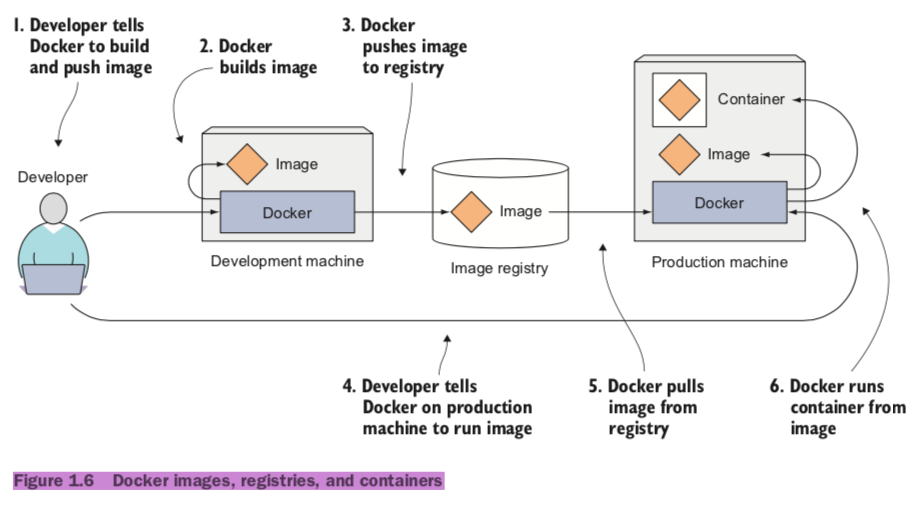

### The need for a system like Kubernets
*	Moving form momolithic apps to microservices
	*	Splitting apps into microservices
	* 	Scaling microservices
	*  Deploying microservices
	*  Environment requirements
*	Providing a consistent environment to applications
* 	Moving to continuous delivery: DevOps and NoOps

#### Prons
*	Helping developers focus on the core app features
* 	Helping OPS teams achieve better resource utilization


### Container
#### Isolating processes with Linux Namespaces
*	Mount(mnt)
* 	Process ID(pid)
*	Network(net)
* 	Inter-process communication(ipc)
*	UTS
* 	User ID(user)

#### Limiting resources available to a process
*	cpu
* 	memory
*	network

#### Docker 


```
# docker run <image>:<tag>
docker run busybox echo "Hello world"

# dockerfile
vim app.js
vim DOCKERFILE

FROM node:7
ADD app.js /app.js
ENTRYPOINT ["node", "app.js"]

docker build -t kubia .

docker images
docker run --name aaaa -p 8080:8080 -d bbbb
docker ps 
docker inspect
docker exec -it aaaa bash
docker start/stop
docker rm
docker rmi
docker tag
docker pull
docker push
```

#### rkt
#### Garden
#### LXD

### Architecture 


*	Master node
	*	etcd
	* 	api
	*  scheduler
	*  controller(Replication/Node/Endpoint/Service Account/Token)
* 	Worker nodes
	*  apps(docker/rkt/lxd)
	*  kubelet
	*  kube-proxy(load-balances network traffic)


### OSes
*	CoreOS
* 	Ubuntu Snappy
*	VMware Photon

### Mesosphere


