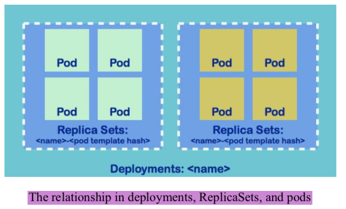
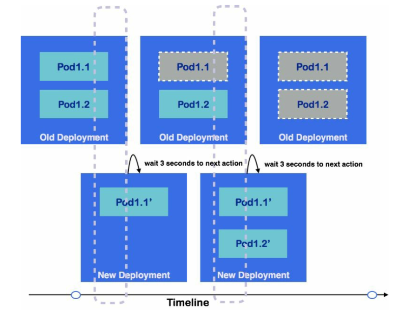
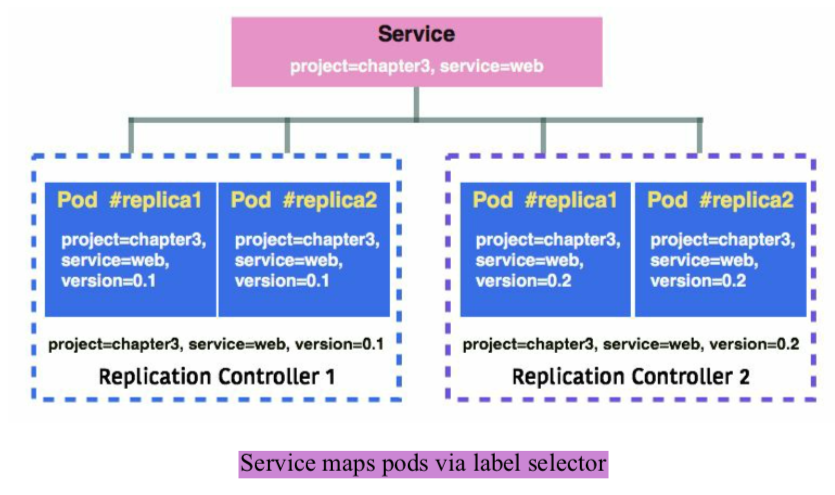
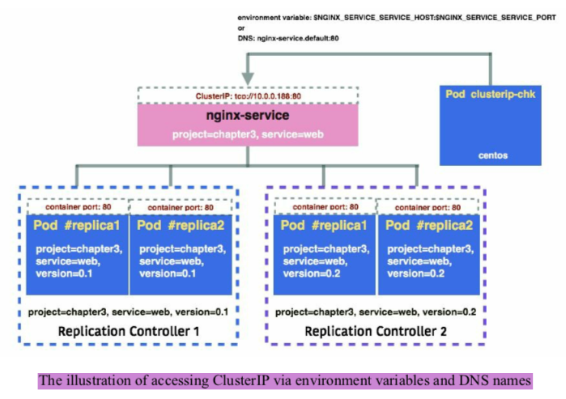

### Minikube(A local single-node Kubernetes)
#### minikube
```
#curl -Lo minikube https://storage.googleapis.com/minikube/releases/v0.23.0/minikube-darwin-amd64
#chmod +x minikube
#sudo mv minikube /usr/local/bin/
curl -Lo minikube https://storage.googleapis.com/minikube/releases/v0.30.0/minikube-darwin-amd64 && chmod +x minikube && sudo cp minikube /usr/local/bin/ && rm minikube


brew cask install minikube
minikube start|stop|delete
kubectl config view
minikube addons enable kube-dns
```

#### Linux
```
yum remove docker docker-*
yum remove docker
yum remove docker-client-latest
ll -rt /var/lib/docker/
yum install -y yum-utils   device-mapper-persistent-data   lvm2
yum-config-manager     --add-repo     https://download.docker.com/linux/centos/docker-ce.repo
yum-config-manager --enable docker-ce-edge
yum-config-manager --enable docker-ce-test
yum install docker-ce
systemctl enable docker
systemctl start docker

systemctl stop firewalld && systemctl disable firewalld
swapoff -a 
setenforce 0
sed -i 's/SELINUX=enforcing/SELINUX=disabled/g' /etc/selinux/config
/usr/sbin/sestatus

minikube delete
rm -rf ~/.minikube
curl -Lo minikube http://kubernetes.oss-cn-hangzhou.aliyuncs.com/minikube/releases/v0.30.0/minikube-darwin-amd64 && chmod +x minikube && sudo mv minikube /usr/local/bin/

curl -Lo minikube http://kubernetes.oss-cn-hangzhou.aliyuncs.com/minikube/releases/v0.30.0/minikube-linux-amd64 && chmod +x minikube

curl -LO https://storage.googleapis.com/kubernetes-release/release/v1.12.0/bin/linux/amd64/kubectl


minikube start --vm-driver=none --registry-mirror=https://registry.docker-cn.com
```

*	https://yq.aliyun.com/articles/221687
* 	https://yq.aliyun.com/articles/508460?spm=a2c4e.11153940.blogcont221687.18.7dd57733EZymVQ

#### kubectl
```
# installation
$ curl -LO https://storage.googleapis.com/kubernetes-release/release/$(curl -s https://storage.googleapis.com/kubernetes-release/release/stable.txt)/bin/darwin/amd64/kubectl && chmod +x kubectl && sudo mv kubectl /usr/local/bin/
```

```
# Linux
curl -LO https://storage.googleapis.com/kubernetes-release/release/ \
       $(curl -s https://storage.googleapis.com/kubernetes-release/ \
       release/stable.txt) \
       /bin/linux/amd64/kubectl

$ chmod +x ./kubectl

$ sudo mv ./kubectl /usr/local/bin/kubectl
```

```
kubectl cluster-info
minikube ssh 
kubectl get nodes
kubectl describe node {node-name}

# deploy
kubectl run kubia --image=luksa/kubia --port=8080 --generator=run/v1

kubectl version
kubectl get componentstatuses
kubectl get nodes
kubectl describe nodes {node-1}
kubectl get daemonSets --name-space=kube-system kube-proxy

kubectl get deployments --name-space=kube-system kube-dns
kubectl get services --name-space=kube-system kube-dns

kubectl get deployments --name-space=kube-system kubernetes-dashboard
kubectl get services --name-space=kube-system kubernetes-dashboard
kubectl proxy
```


### Online
*	https://kubernetes.io/docs/tutorials/kubernetes-basics/
*	http://play-with-k8s.com

### Configuration
```
apiVersion: Kubernetes API version
kind: object type
metadata:
	spec metadata, i.e. namespace, name, lables and annotations
spec:
	the spec of Kubernetes objects
```

#### Namespace
*	An isolation as multiple virtual clusters.
* 	Useful when different teams or projects are sharing the same cluster.
*	Important for resource management and role(Cluster Administration).

```
default
kube-system
kube-public
```

#### Name
*	Every object in Kubernetes owns its own name.
* 	Object name in one resource is uniquely identified within the same namespace.
*  As part of a resource URL to API server(小写字母或数字,下划线,点, <254).
*  UID

#### Labelas and selectors
*	key/value

```
# labels
labels:
	$k1: $v1
	$k2: $v2
```

*	equality-based selector: `=`, `==`, `!=`

```	
selector:
	$k1: $v1

# equality-based: =, ==, !=
env=dev, version!=0.1
```

*	set-based selector: `in`, `notin`, `exists`

```
selector:
	matchLabels:
		$k1: $v1
	matchExpressions:
		{key: $k2, operator: In, values:[$v1, $v2]}

# set-based: in, notin, exists
env in (dev,uat),version
```

#### Annotaion
*	key/value

```
annotations:
	$k1: $v1
	$k2: $v2
```


```
# add 
kubectl lable|annotation pods <pod_name> {lable_key}={lable_value}

# overwrite
kubectl lable|annotation pods <pod_name> {lable_key}={lable_value} --overwrite

# delete
kubectl lable|annotation pods <pod_name> -{lable_key}
```

#### Pods
```
kubectl explain pods
```

```
vim 3-2-1_pod.yaml
apiVersion: v1
kind: Pod
metadata:
	name: example
spec:
	containers:
	- name: web
	  image: nginx
	- name: centos
	  image: centos
	  command:["/bin/sh", "-c", "while : ; do curl http://localhost:80/; sleep 10; done"]
```


```
kubectl create -f 3-2-1_pod.yaml
kubectl get pods [--namespace=kube-system]
kubectl logs [pod_name] -c [container_name]
kubectl describe [resource] [resource_name]
kubectl describe pod example
```

#### ReplicaSets(RS) and ReplicationControllers(RC)
*	RC use equality-based selector, RS use set-based selector.
* 	RC is created by users, RC is created by Kubernetes Deployment objects.

```
# vim 3-2-2_rc.yaml
apiVersion: v1
kind: ReplicationController
metadata:
	name: nginx
spec:
	replicas: 2
	selector:
		project: ch3
		service: web
		version: "0.1"
	template:
		metadata:
			name: nginx
			lables:
				project: ch3
				service: web
				version: "0.1"
			spec:
				containers:
				- name: nginx
				  imgae: nginx
				  ports:
				  - containerPort: 80

# kubectl create -f 3-2-2_rc.yaml
# kubectl get rc
# kubectl get pods
```

*	scale on demand

```
kubectl edit <resource> <resource_name>
kubectl edit rc nginx
kubectl get rc
kubectl describe rc nginx

kubectl delete <resource> <resource_name>
kubectl delete rc nginx
```

*	For RC:
	*	`apiVersion` is `extensions/v1betal`
	* 	set-based selector: `matchLables` and `matchExpressions` 

```
# vim 3-2-2_rs.yaml
apiVersion: extensions/v1betal
kind: ReplicaSet
metadata:
	name: nginx
spec:
	replicas: 2
	selector:
		matchLabels:
			project: ch3
		matchExpressions:
			- { key: service, operator:In, values: ["0.1","0.2"] }
	template:
		metadata:
			name: nginx
			lables:
				project: ch3
				service: web
				version: "0.1"
			spec:
				containers:
				- name: nginx
				  imgae: nginx
				  ports:
				  - containerPort: 80

# kubectl create -f 3-2-2_rs.yaml
# kubectl get rs
# kubectl get pods
```


#### Deployments(Since 1.2)
*	gracefully deploying
* 	rolling updating
*	rolling back pods and ReplicaSets

```
kubectl run nginx --image=nginx:1.12.0 --replicas=2 --port=80
kubectl get deployments
kubectl get pods
kubectl get rs
kubectl expose deployment nginx --port=80 --target-port=80
kubectl get service
```




```
# vim 3-2-3_deployments.yaml
apiVersion: apps/v1betal
kind: Deployment
metadata:
	name:nginx
spec:
	replicas: 2
	template:
		metadata:
			labels:
				run: nginx
		spec:
			containers:
			- name: nginx
			  image: nginx: 1.12.0
			  ports:
			  - containerPort: 80
---
kind: Service
apiVersion: v1
metadata:
	name: nginx
	lables:
		run: nginx
spec:
	selector:
		run: nginx
	ports:
		- protocol: TCP
		  port: 80
		  targetPort: 80
		  name: http

kubectl create -f 3-2-3_deployments.yaml
```

*	rolling update strategy
	*	`minReadySeconds` 0
	* 	`maxSurge` 25%
	*	`maxUnavaliable` 25%

```
minReadySeconds: 3
stategy:
	type: RollingUpdate
	rollingUpdate:
		maxSurge: 1
		maxUnavaliable: 1
``` 

```
kubectl edit deployments nginx
kubectl replace -f rolling_update.yaml
kubectl set image deployment nginx nginx=nginx:1.13.1
kubectl describe
# rollback
kubectl set image deployment nginx nginx=nginx:1.12.0
```

*	Illustration of deployments




#### Services
*	An abstraction layer for routing traffic to a logical set of pods. Don't need to trace the IP address of each pod.
* 	Use label selector.



*	Service types
	*	ClusterIP
	* 	NodePort
	*  LoadBalancer
	*  ExternalName


##### ClusterIP
*	Default service type.
* 	It exposes the service on a cluster-internal IP.
*  	Pods in the cluster could reach the service via the IP address, environment variables, DNS

*	Seven environment variables:
	*	`${SVCNAME}_SERVICE_HOST`
	* 	`${SVCNAME}_SERVICE_PORT`
	*	`${SVCNAME}_PORT`
	* 	`${SVCNAME}_PORT_${PORT}_${PROTOCAL}`
	*  	`${SVCNAME}_PORT_${PORT}_${PROTOCAL}_PROTO`
	*	`${SVCNAME}_PORT_${PORT}_${PROTOCAL}_PORT`
	*	`${SVCNAME}_PORT_${PORT}_${PROTOCAL}_ADDR`



*	`kube-dns`
	*	clusterIP: `$servicename.$namaspace` 
	* 	port: `_$portname_$protocal.$servicename.$namespace`
	*  e.g.: `http://nginx-service.default:_http_tcp.nginx-service.default/`


##### NodePort

##### LoadBalancer

##### ExternalName

##### Service without selectors(Proxy)
*	use `service` and `endpoint`

#### Volumes

#### Secrets
*	docker-registry

```
kubectl create secret docker-registry <registry_name> --docker-server=<docker_server> --docker-username=<docker_username> --docker-password=<docker_password> --docker-email=<docker_email>

kubectl create secret generic mypassword --from-file=<file_path>
```


#### ConfigMap(cm)
*	It injects the configuration data as key/value pairs into pods.
* 	Secret is used to store sensitive data, ConfigMap is used to store insensitive configuration data.

```
kubectl create configmap example --from-file=<file_path_1> ...
kubectl describe configmap example
kubectl edit configmap example
```

*	Using configmap via volume(`volumeMounts`)

*	Using configmap via environment variables(`env`)
