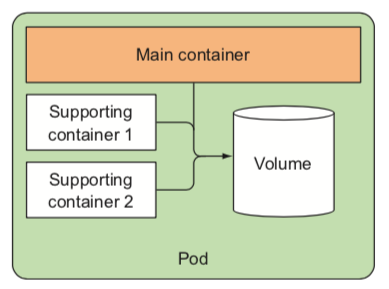

### Pods
*	A pod is a group of one or more tightly related containers that will always run together on the same worker node and in the same Linux namespace(s).
* 	Each pod is like a separate logical machine with its own IP, hostname, processes, and so on, running a single application. 
*	The application can be a single process, running in a single container, or it can be a main application process and additional supporting processes, each running in its own container.


*	It never spans multiple worker nodes.


```
# deploy
kubectl run kubia --image=luksa/kubia --port=8080 --generator=run/v1
kubectl get pods
kubectl describe pod {pod_name}
```


*	To make the pod accessible from the outside, you’ll expose it through a Service object.

```
# rc -> replicationcontroller
# po -> pods
# svc -> services
# minikube service kubia-http
kubectl expose rc kubia --type=LoadBalancer --name kubia-http
kubectl get services
kubectl get svc
curl 104.155.74.57:8080
```


#### Horizontally scalling the application
```
kubectl get replicationcontrollers
kubectl scale rc kubia --replicas=3
kubectl get rc
kubectl get pods
kubectl get pods -o wide
kubectl describe pod {node_name}
kubectl cluster-info | grep dashboard
```


#### The Flat inter-pod network
*	All pods in a Kubernetes cluster reside in a single flat, shared, network-address space, which means every pod can access every other pod at the other pod’s IP address.
* 	No NAT (Network Address Translation) gateways exist between them.
*	Pods are logical hosts and behave much like physical hosts or VMs in the non-container world.


#### JSON/YAML
```
kubectl get po kubia-zxzij -o yaml
kubectl explain pods
kubectl explain pod.spec
kubectl create -f kubia-manual.yaml
kubectl get po kubia-manual -o yaml
kubectl get po kubia-manual -o json
kubectl get pods
#docker logs <container id>
kubectl logs kubia-manual
```

#### Port forwarding
```
# not service
kubectl port-forward kubia-manual 8888:8080
```


#### Organizing pods with labels
*	multiple replications
* 	multiple versions(stable, beta, canary, UAT)


```
kubectl get po --show-labels
kubectl get po -L creation_method,env

kubectl label po {pod_name} creation_method=manual
kubectl label po kubia-manual-v2 env=debug --overwrite
```

*	 Label selectors allow you to select a subset of pods tagged with certain labels and perform an operation on those pods. 

```
kubectl get po -l creation_method=manual
kubectl get po -l env
kubectl get po -l '!env'
```

#### Annotating pods
*	Like `lables`, but there’s no such thing as an annotation selector.
* 	Annotations are also commonly used when introducing new features to Kuberne- tes.
*	A great use of annotations is adding descriptions for each pod or other API object.

```
kubectl get po kubia-zxzij -o yaml
kubectl annotate pod kubia-manual mycompany.com/someannotation="foo bar"
```

#### Using namespaces to group resources
```
kubectl get ns
kubectl get po --namespace kube-system
kubectl create namespace custom-namespace
kubectl create -f kubia-manual.yaml -n custom-namespace
```

#### Stopping and removing pods
```
kubectl delete po kubia-gpu
kubectl delete po -l creation_method=manual
kubectl delete po -l r
kubectl delete ns custom-namespace
kubectl delete all --all

kubectl get pods
kubectl delete po --all
kubectl get pods
```

#### Keys
*	Don't use containers directly, but pods(single or multiple containers together) instead.
*	Don't run multiple processes in a single container.
*	A pod of containers allows you to run closely related processes together and provide them with (almost) the same environment as if they were all running in a single container, while keeping them somewhat isolated.
*	Instead of stuffing everything into a single pod, you should organize apps into multiple pods, where each one contains only tightly related components or processes.
*	SPLITTING MULTI-TIER APPS INTO MULTIPLE PODS.
* 	SPLITTING INTO MULTIPLE PODS TO ENABLE INDIVIDUAL SCALING(A pod is also the basic unit of scaling.)
*  The main reason to put multiple containers into a single pod is when the application consists of one main process and one or more complementary processes.




### Summary
*	容器组能否运行于同一个node(same pod)或不同node(multiple pods)
*	container-to-container within a Pod(use the Pod's `localhost` interface)


