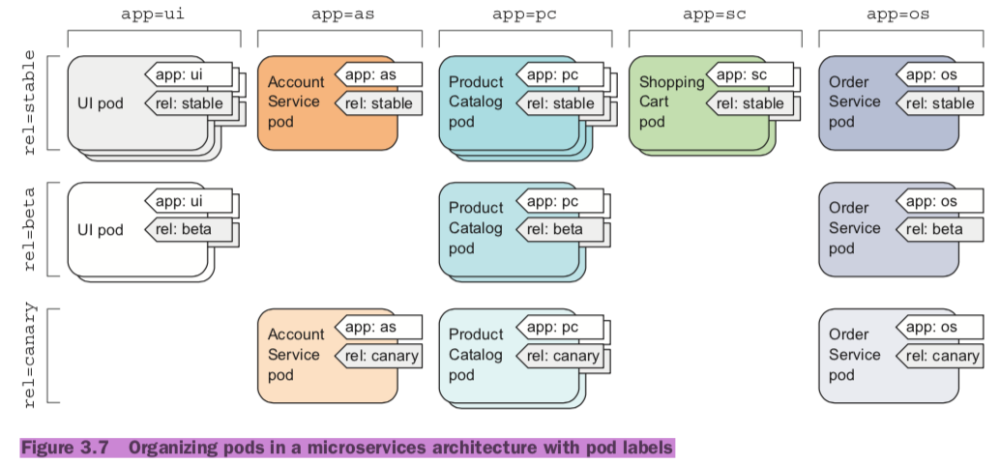

### Lable
#### Labelas and selectors
*	key/value

```
# labels
labels:
	$k1: $v1
	$k2: $v2
```

*	equality-based selector: `=`, `==`, `!=`

```	
selector:
	$k1: $v1

# equality-based: =, ==, !=
env=dev, version!=0.1
```

*	set-based selector: `in`, `notin`, `exists`

```
selector:
	matchLabels:
		$k1: $v1
	matchExpressions:
		{key: $k2, operator: In, values:[$v1, $v2]}

# set-based: in, notin, exists
env in (dev,uat),version
```

#### Annotaion
*	key/value

```
annotations:
	$k1: $v1
	$k2: $v2
```

```
# add 
kubectl lable|annotation pods <pod_name> {lable_key}={lable_value}

# overwrite
kubectl lable|annotation pods <pod_name> {lable_key}={lable_value} --overwrite

# delete
kubectl lable|annotation pods <pod_name> -{lable_key}
```


#### Organizing pods with labels
*	multiple replications
* 	multiple versions(stable, beta, canary, UAT)



```
kubectl get po --show-labels
kubectl get po -L creation_method,env

kubectl label po {pod_name} creation_method=manual
kubectl label po kubia-manual-v2 env=debug --overwrite

kubectl get pods --selector="{k1}={v1},{k2}={v2}"
kubectl get pods --selector="k in {v1, v2}"
```

*	 Label selectors allow you to select a subset of pods tagged with certain labels and perform an operation on those pods. 

```
kubectl get po -l creation_method=manual
kubectl get po -l env
kubectl get po -l '!env'
```

#### Using labels for categorizing worker nodes

```
kubectl label node gke-kubia-85f6-node-0rrx gpu=true

kubectl get nodes -l gpu=true
```

##### Scheduling pods to specific nodes
```
apiVersion: v1
kind: Pod
metadata:
  name: kubia-gpu
spec:
  nodeSelector:
    gpu: "true"
  containers:
  - image: luksa/kubia
name: kubia
```
