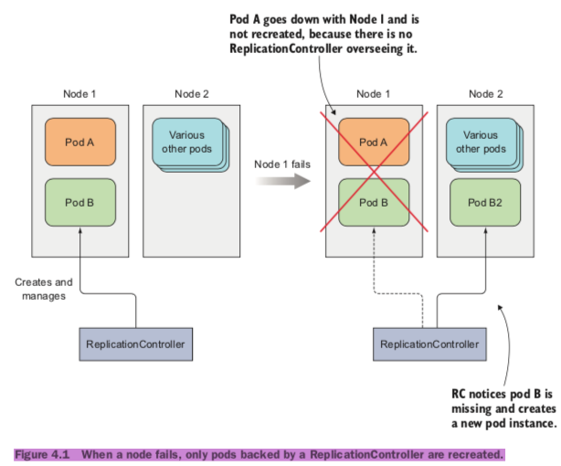
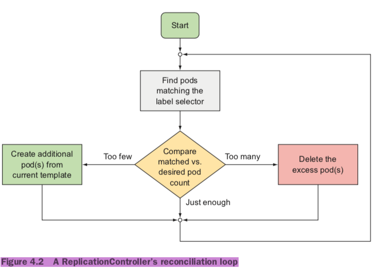
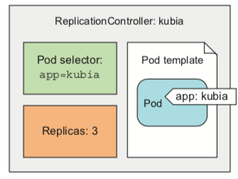
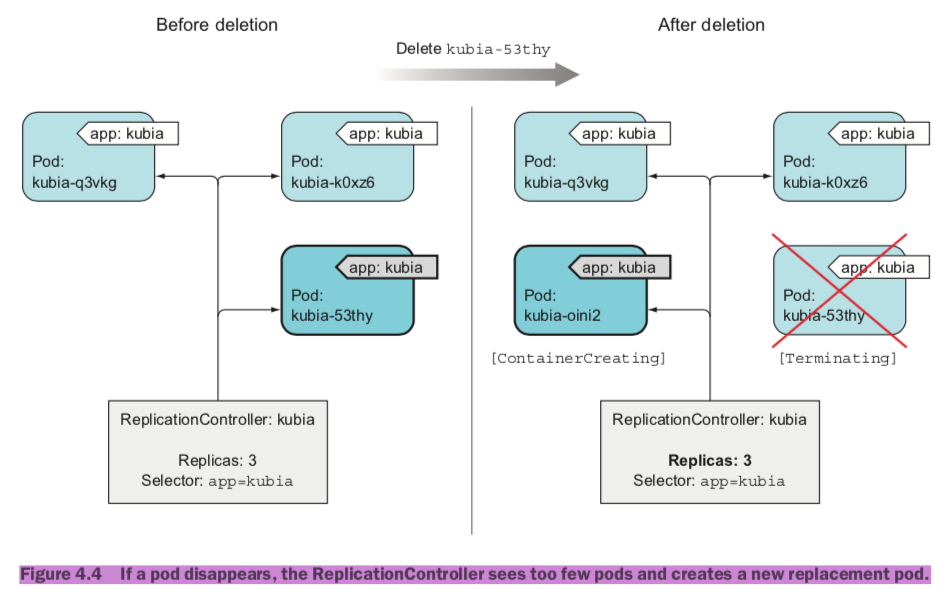
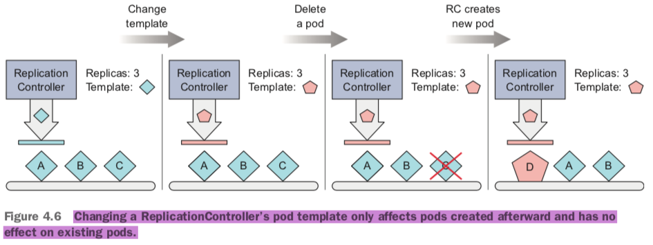
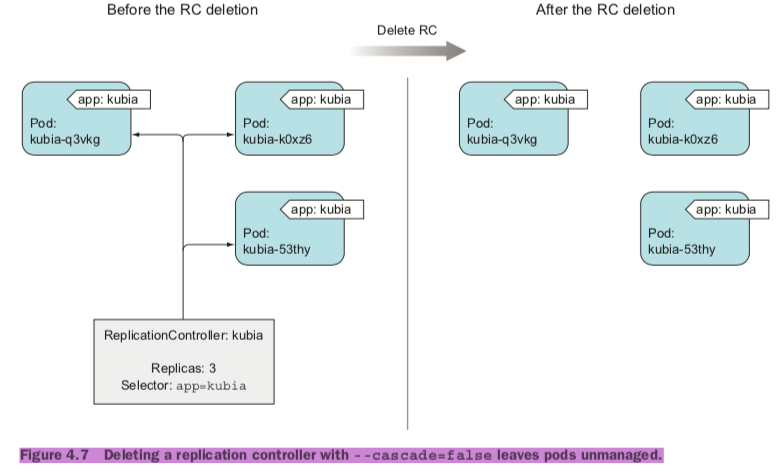
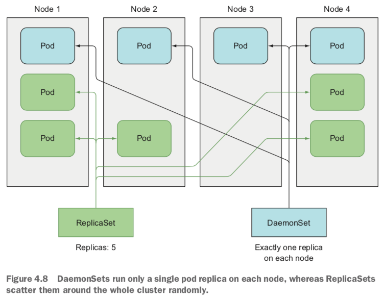
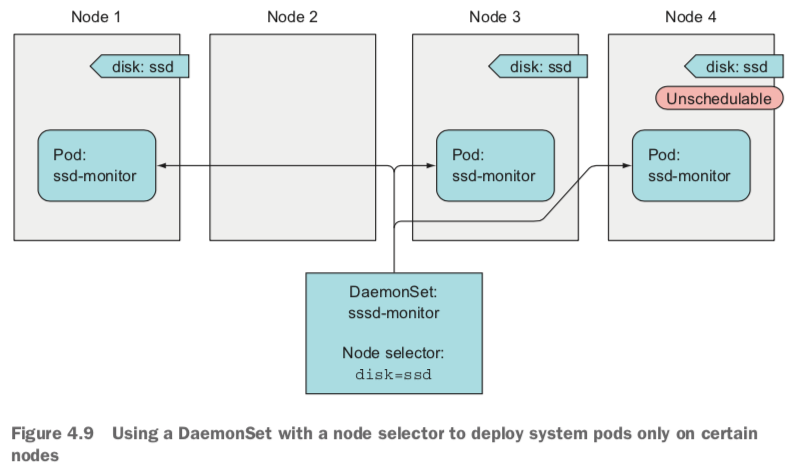
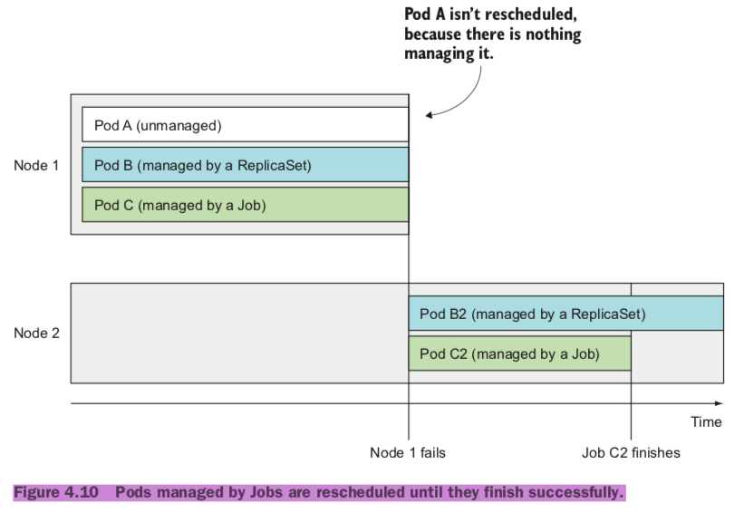

## Controllers
### Keeping pods healthy
*	http get probe
* 	tcp socker probe
*	exec probe

```
apiVersion: v1
kind: pod
metadata:
	name: kubia-liveness
spec:
	containers:
		image: luksa/kubia-unhealthy
		name: kubia
		livenessProbe:
			httpGet:
				path: /
				port: 8080
		initialDelaySeconds: 15
```

```
kubectl get po kubia-liveness
kubectl logs mypod --previous
kubectl describe po kubia-liveness
```

### ReplicationControllers(RC)
*	Ensures its pods are always kept running. 



*	A ReplicationController’s job is to make sure that an exact number of pods always matches its label selector.



*	The three key parts of a ReplicationController (pod selector, replica count, and pod template)



```
apiVersion: v1
kind: ReplicationController
metadata:
	name: kubia
spec:
	replicas: 3
	selector:
		app: kubia
template:
	metadata:
		labels:
			app: kubia
	spec:
		containers:
			- name: kubia
			image: luksa/kubia
			ports:
				- containerPort: 8080

$ kubectl create -f kubia-rc.yaml

$ kubectl get pods
$ kubectl delete pod kubia-53thy
$ kubectl get pods

$ kubectl get rc
$ kubectl describe rc kubia
```




*	Removing pods from controller 
*	Changing the ReplicationController's lable selector(Never)

#### Changing the pod template
*	A ReplicationController’s pod template can be modified at any time. Changing the pod template is like replacing a cookie cutter with another one.
*	只对新上线有影响,可用于迭代发布



```
$ kubectl edit rc kubia
```

#### Horizontally scaling pods
```
$ kubectl scale rc kubia --replicas=10
# or
$ kubectl edit rc kubia
  replicas: 10
$ kubectl get rc
$ kubectl scale rc kubia --replicas=3
```

#### Deleting a ReplicationController
*	When you delete a ReplicationController through `kubectl delete`, the pods are also deleted.
* 	You can delete only the ReplicationController and leave the pods running.



```
$ kubectl delete rc kubia --cascade=false
```

### Using ReplicaSets(RS) instead of ReplicationControllers
*	You should always create ReplicaSets instead of ReplicationControllers from now on.
* 	A ReplicationController's label selector only allows matching pods that include a certain label, a ReplicaSet's selector also allows matching pods that lack a certain label or pods that include a certain label key, regardless of its value.
*	RC use equality-based selector, RS use set-based selector.
* 	RC is created by users, RC is created by Kubernetes Deployment objects.

#### Defining a ReplicaSet
```
apiVersion: apps/v1beta2
kind: ReplicaSet
metadata:
  name: kubia
spec:
  replicas: 3
  selector:
    matchLabels:
      app: kubia
  template:
    metadata:
      labels:
        app: kubia
    spec:
      containers:
      - name: kubia
        image: luksa/kubia
```

```
$ kubectl get rs
$ kubectl describe rs
```

*	A matchExpressions selector

```
selector:
  matchExpressions:
    - key: app
      operator: In
      values:
		- kubia

# In
# NotIn
# Exists
# DoesNotExist
```

*	delete the ReplicaSet to clean up your cluster a little

```
$ kubectl delete rs kubia
```

### DaemonSets(Running exactly one pod on each node)
*	infrastructure-related pods(a log collector or a resource monitor)



#### Run a pod on every node
*	If a node goes down, the DaemonSet doesn’t cause the pod to be created else- where. But when a new node is added to the cluster, the DaemonSet immediately deploys a new pod instance to it. It also does the same if someone inadvertently deletes one of the pods, leaving the node without the DaemonSet’s pod. 

#### Run pods only on certain nodes
*	`nodeSelector`(部署到部分集群和节点,用于环境隔离或集群隔离)



```
apiVersion: apps/v1beta2
kind: DaemonSet
metadata:
  name: ssd-monitor
spec:
  selector:
    matchLabels:
      app: ssd-monitor
  template:
    metadata:
      labels:
        app: ssd-monitor
    spec:
      nodeSelector:
        disk: ssd
      containers:
		- name: main
        image: luksa/ssd-monitor
```


```
$ kubectl create -f ssd-monitor-daemonset.yaml
$ kubectl get ds
$ kubectl get po
$ kubectl get node
$ kubectl label node minikube disk=ssd
$ kubectl get po
$ kubectl label node minikube disk=hdd --overwrite
$ kubectl get po
```


### Running pods that perform a single completable task
*	`ReplicationControllers`, `ReplicaSets`, and `DaemonSets` run continuous tasks that are never considered completed.



#### Defining a Job resource
```
apiVersion: batch/v1
kind: Job
metadata:
  name: batch-job
spec:
  template:
    metadata:
      labels:
        app: batch-job
    spec:
      restartPolicy: OnFailure
      containers:
      - name: main
        image: luksa/batch-job
```

```
$ kubectl get jobs
$ kubectl get po
$ kubectl get po -a
$ kubectl logs batch-job-28qf4
$ kubectl get job
```

#### Running multiple pod instances in a Job
*	`completions`, `parallelism`

```
apiVersion: batch/v1
kind: Job
metadata:
  name: multi-completion-batch-job
spec:
  completions: 5
  parallelism: 2
  template:
  
$ kubectl get po
$ kubectl scale job multi-completion-batch-job --replicas 3
```

#### `CronJob`(Scheduling Jobs to run periodically or once in the future)

```
apiVersion: batch/v1beta1
kind: CronJob
metadata:
	name: batch-job-every-fifteen-minutes
spec:
  schedule: "0,15,30,45 * * * *"
  jobTemplate:
    spec:
      template:
        metadata:
          labels:
            app: periodic-batch-job
        spec:
          restartPolicy: OnFailure
          containers:
          - name: main
            image: luksa/batch-job
```
