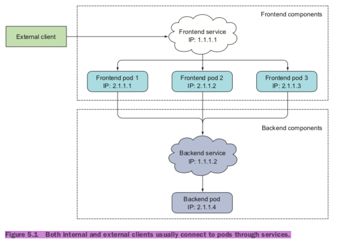
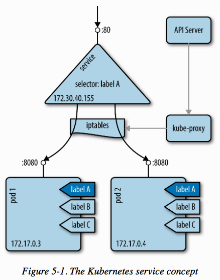
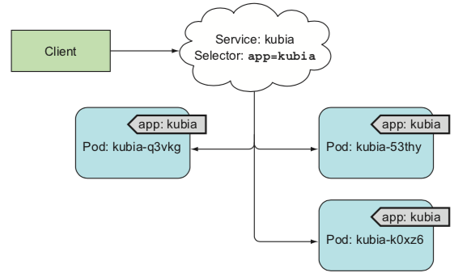
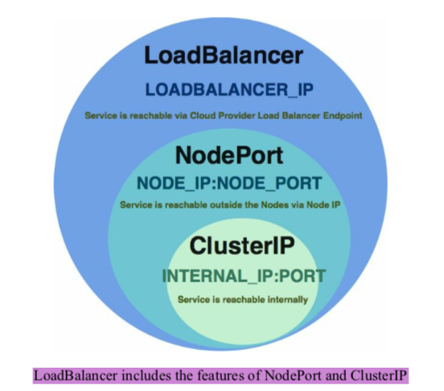
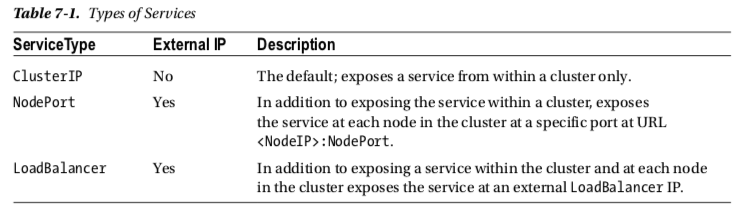
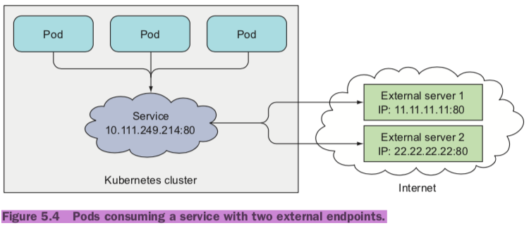
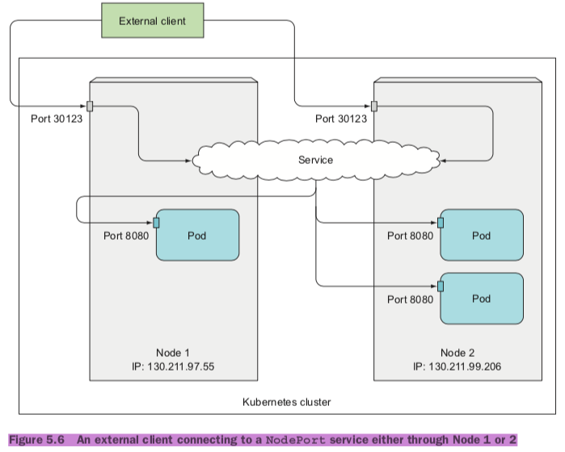
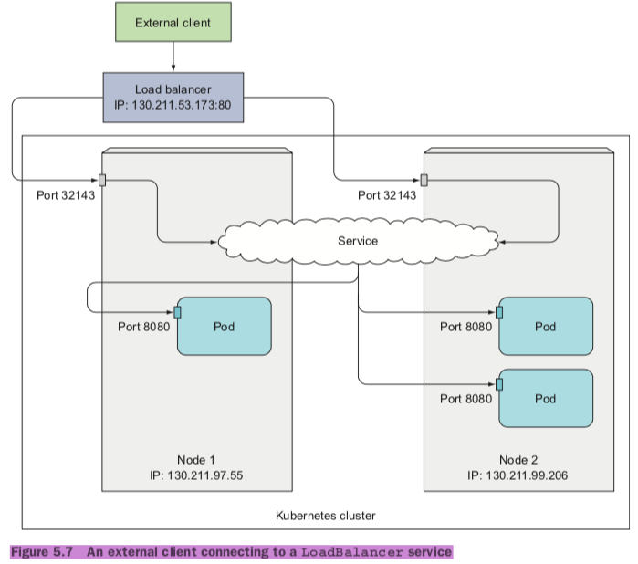
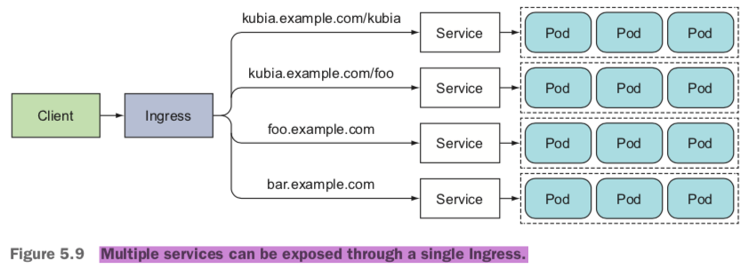
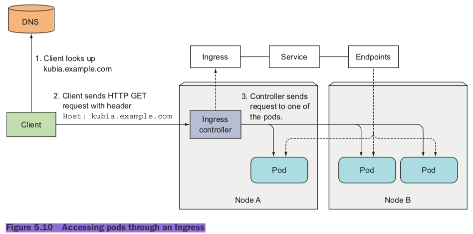

*	Pods are ephemeral
* 	Kubernetes assigns an IP address to a pod after the pod has been scheduled to a node and before it’s started
*	Horizontal scaling means multiple pods may provide the same service

## Services
*	A Kubernetes Service is a resource you create to make a single, constant point of entry to a group of pods providing the same service.
*	The service address doesn't change even if the pod's IP address changes.



*	Lable selector determine which pods belong to the Service.






*	Service types
	*	ClusterIP(default, within the cluster)
	* 	NodePort
	*  LoadBalancer
	*  ExternalName






### Creating a service
*	CREATING A SERVICE THROUGH KUBECTL EXPOSE

```
kubectl expose
```

*	CREATING A SERVICE THROUGH A YAML DESCRIPTOR

```
apiVersion: v1
kind: Service
metadata:
  name: kubia
spec:
  ports:
  - port: 80
    targetPort: 8080
  selector:
	app: kubia
```

```
$ kubectl get svc
$ kubectl describe {service_name}
$ kubectl exec kubia-7nog1 -- curl -s http://10.111.249.153
```


*	CONFIGURING SESSION AFFINITY ON THE SERVICE(This makes the service proxy redirect all requests originating from the same client IP to the same pod.)
* 	Session affinity cannot be based on cookies(cookies are a construct of the HTTP protocol, services don’t know about them)

```
apiVersion: v1
kind: Service
spec:
  sessionAffinity: ClientIP
```

*	EXPOSING MULTIPLE PORTS IN THE SAME SERVICE

```
apiVersion: v1
kind: Service
metadata:
	name: kubia
spec: 
	ports:
  		- name: http
    		port: 80
    		targetPort: 8080
  		- name: https
			port: 443
    	targetPort: 8443
  selector:
	app: kubia
```


### Creating a ClusterIP Service
```
kubectl run nginx --image=nginx/tanhao --replicas=3 --port=80
kubectl get deployments
kubectl get pods
kubectl expose deployment nginx --port=80 --type=ClusterIP
kubectl get services
kubectl describe svc nginx
curl
```

### Creating a NodePort Service
```
kubectl delete svc nginx
kubectl expose deployment nginx --port=80 --type=NodePort
kubectl get services
kubectl describe svc nginx
curl
```

### Creating a LoadBalancer Service
```
kubectl delete svc nginx
kubectl expose deployment nginx --port=80 --type=LoadBalancer
kubectl get services
kubectl describe svc nginx
curl
```

### Discovering services
#### DISCOVERING SERVICES THROUGH ENVIRONMENT VARIABLES
```
$ kubectl exec kubia-3inly env
```

#### DISCOVERING SERVICES THROUGH DNS

#### CONNECTING TO THE SERVICE THROUGH ITS FQDN
```
backend-database.default.svc.cluster.local
{service-name}.{namespace}.svc.cluster.local
```

#### RUNNING A SHELL IN A POD’S CONTAINER
```
$ kubectl exec -it kubia-3inly bash
# nsloopup 
cat /etc/resolv.conf
```


### Connecting to services living outside the cluster
#### service endpoints
```
$ kubectl describe svc kubia
$ kubectl get endpoints kubia
```

#### Manually configuring service endpoints
*	To create a service with manually managed endpoints, you need to create both a Service and an Endpoints resource.

```
# CREATING A SERVICE WITHOUT A SELECTOR
apiVersion: v1
kind: Service
metadata:
  name: external-service
spec:
	ports:
		- port: 80

# CREATING AN ENDPOINTS RESOURCE FOR A SERVICE WITHOUT A SELECTOR
apiVersion: v1
kind: Endpoints
metadata:
  name: external-service
subsets:
  - addresses:
    - ip: 11.11.11.11
    - ip: 22.22.22.22
    ports:
    - port: 80
```




#### Creating an alias for an external service
*	Instead of exposing an external service by manually configuring the service’s End- points, a simpler method allows you to refer to an external service by its fully qualified domain name (FQDN).

```
# CREATING AN EXTERNALNAME SERVICE
apiVersion: v1
kind: Service
metadata:
  name: external-service
spec:
  type: ExternalName
  externalName: someapi.somecompany.com
  ports:
  - port: 80
```


### Exposing services to external clients
*	Setting the service type to NodePort
* 	Setting the service type to LoadBalancer, an extension of the NodePort type
*  Creating an Ingress resource, a radically different mechanism for exposing multiple ser- vices through a single IP address

#### Using a NodePort service
```
apiVersion: v1
kind: Service
metadata:
  name: kubia-nodeport
spec:
	type: NodePort
  	ports:
 	 - port: 80
    	targetPort: 8080
    	nodePort: 30123
  	selector:
		app: kubia
```


```
$ kubectl get svc kubia-nodeport
```



#### Exposing a service through an external load balancer
```
# CREATING A LOADBALANCER SERVICE
apiVersion: v1
kind: Service
metadata:
  name: kubia-loadbalancer
spec:
  type: LoadBalancer
  ports:
  - port: 80
    targetPort: 8080
  selector:
app: kubia

$ kubectl get svc kubia-loadbalancer
```



#####  externalTrafficPolicy

#### Exposing services externally through an Ingress resource


```
$ minikube addons list
$ minikube addons enable ingress
$ kubectl get po --all-namespaces
```

```
# Creating an Ingress resource
apiVersion: extensions/v1beta1
kind: Ingress
metadata:
  name: kubia
spec:
  rules:
  - host: kubia.example.com
http: paths:
      - path: /
        backend:
          serviceName: kubia-nodeport
          servicePort: 80
```

```
$ kubectl get ingresses
```




*	Ingress exposing multiple services on same host, but different paths

```
- host: kubia.example.com
http: paths:
      - path: /kubia
        backend:
          serviceName: kubia
          servicePort: 80
      - path: /foo
        backend:
          serviceName: bar
          servicePort: 80
```

*	Ingress exposing multiple services on different hosts

```
spec: rules:
  - host: foo.example.com
    http:
      paths:
      - path: /
        backend:
          serviceName: foo
          servicePort: 80
  - host: bar.example.com
    http:
      paths:
      - path: /
        backend:
          serviceName: bar
          servicePort: 80
```


#### CREATING A TLS CERTIFICATE FOR THE INGRESS
```
$ openssl genrsa -out tls.key 2048
$ openssl req -new -x509 -key tls.key -out tls.cert -days 360 -subj /CN=kubia.example.com
$ kubectl create secret tls tls-secret --cert=tls.cert --key=tls.key
$ kubectl certificate approve <name of the CSR>
```
