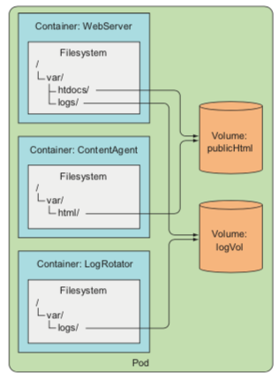
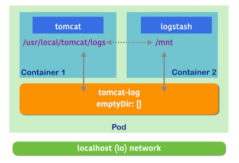
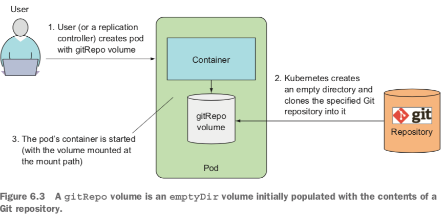
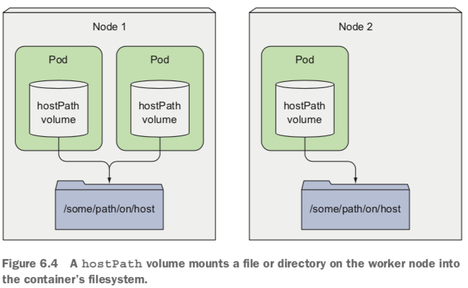

*	stateless applications(use ephemeral volume, don't need to perserve the data)
*	stateful(use persisitent volume)



### Definitions
*	`spec.volumes` array defines all of the volumes that may be accessed by containers in the Pod mainfest.
* 	`volumeMounts` array in the container definition(defines the volumes that are mounted into a particular container)
*  	Two different containers in a Pod can mount the same volume at different mount paths.

### Volume types
*	`emptyDir`
	*	A per-pod volume that is initially empty and shared by containers in a pod.
	* 	Each container may mount the volume at the same or different path.
	*  medium
		*	ssd 
		* 	nfs
		*  memory
	*	Delete when the pod is deleted.   
* 	`hostPath`
	*	Mounts a file or a directory from the host node's file system into the pod.
	* 	Writable by root only the volume data persits even id the pod is deleted.
	*  All containers in the pod can access the volume.
	*  Designed for single node test only and supported in a multi-node cluster.  
*	`gitRepo`
	*	Clones a Git repository into an empty directory. 
* 	`nfs`
	*	A persistent volume; mounts a Network File System (NFS) into a pod.  
*	`gcePersistentDisk`, `awsElasticBlockStore`, `azureDisk`
*	`cinder`, `cephfs`, `iscsi`, `flocker`, `glusterfs`, `quobyte`, `rbd`, `flexVolume`, `vsphereVolume`, `photonPersistentDisk`, `scaleIO`
*	`configMap`, `secret`, `downwardAPI`
*	`persistentVolumeClaim`
	*	Mounts a PersistentVolume into a pod. 

### Sharing volume between containers within a pod



####	`emptyDir` (不通过网络)
*	The volume starts out as an empty directory.
* 	The volume's contents are lost when the pod is deleted.
*  	Useful for sharing files between containers running in the same pod.(单容器临时数据集也可用)

```
apiVersion: apps/v1betal
kind: Deployment
metadata:
	name: tomcat
sepc:
	rplicas: 1
	template:
		metadata:
			lables:
				run: tomcat
		spec:
			containers:
			- image: tomcat
			  name: tomcat
			  ports:
			 	- containerPort: 8080
			  env:
			 	- name: UMASK
			 	  value: "0022"
			  volumeMounts:
			 	- mountPath: /usr/local/tomcat/logs
			 	  name: tomcat-log
			 - imgae: logstash
			   name: logstash
			   args: ["-e input {file {path => \"/mnt/localhost_access_log.*\"}} output { stdout {codec => rubydebug} elasticsearch { hosts => [\"http://elasticsearch-svc.default.svc.cluster.local:9200\"]}}}"]
			   volumeMounts:
			    - mountPath: /mnt
			      name: tomcat-log
			  volumes:
			  	- name: tomcat-log
			  	  emptyDir: {}
			   
```

*	SPECIFYING THE MEDIUM TO USE FOR THE EMPTYDIR

```
volumes:
	- name: html
	  emptyDir:
	  	medium: Memory
```

*	Communication/synchroniztion
* 	Cache


#### `gitRepo`



```
apiVersion: v1
kind: Pod
metadata:
	name: gitrepo-volume-pod
spec:
	containers:
	- image: nginx:apline
	  name: web-server
	  volumeMounts:
	  - name: html
	  	 mountPath: /usr/share/nginx/html
	  	 readOnly: true
	  ports:
	  - containerPort: 80
	    protocol: TCP
	volumes:
	- name: html
	  gitRepo:
	  	repository: https://github.com/luksa/kubia-website-example.git
	  	revision: master
	  	directory: .
```

*	sidecar continer(git-sync)	

### Accessing files on the worker node’s filesystem
*	`DaemonSet`
* 	`hostPath`(persistent storage on a specific node, not good for database)
*	Remember to use hostPath volumes only if you need to read or write system files on the node. Never use them to persist data across pods.




```
kubectl get pid s --namespace kube-system
```

### Using persistent storage(this data needs to be accessible from any cluster node)

*	`gcePersistentDisk`
* 	`awsElasticBlockStore`
*	`azureFile`, `azureDisk`

#### NFS
```
volumes:
- name: mongodb-data
  nfs:
  	server:
  	path:  
```


### TD
