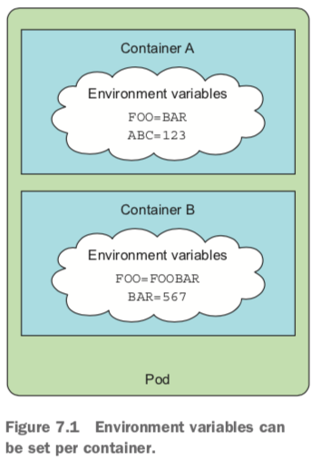
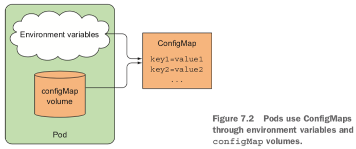
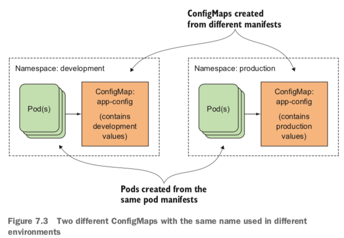
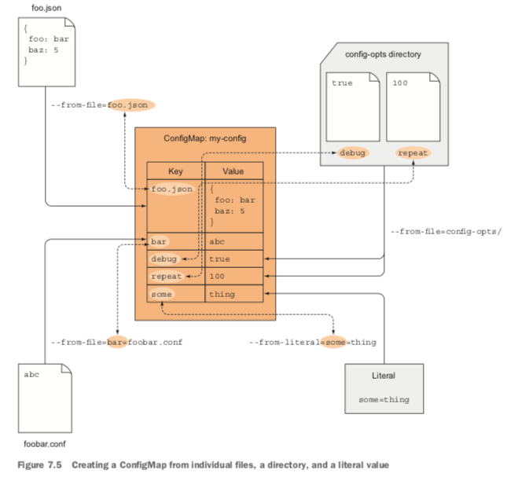
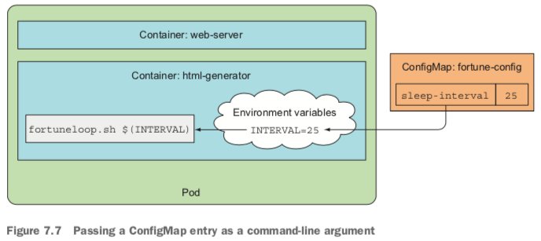
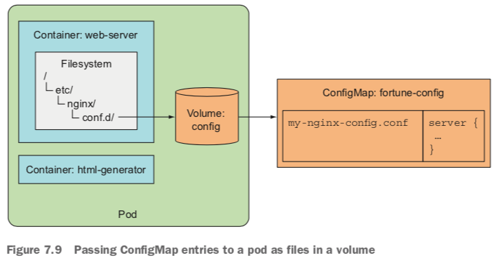
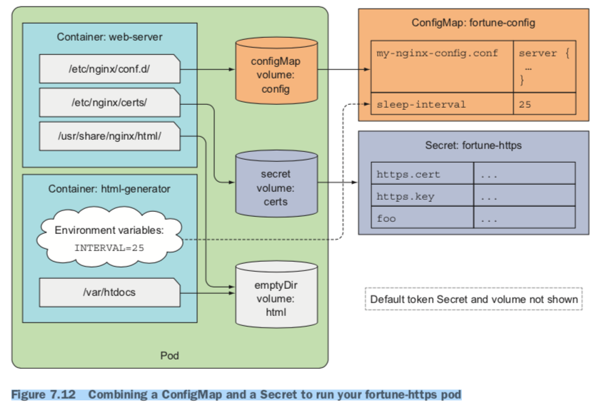

## ConfigMaps and Secrets

### Overriding the command and arguments in Kubernetes
```
kind: pod
spec:
	containers:
	- image: some/tags
	  command: ["/bin/command"]
	  args: ["arg1", "arg2", "arg3"]
```


### Setting environment variables for a container


```
kind: pod
spec:
	containers:
	- image: some/tags
	  env:
	  - name: INTERVAL
	    value: "30"
```

*	Referring to an environment variable inside another one

```
env:
- name: FIRST_VAR
  value: "foo"
- name: SECOND_VAR
  value: "$(FIRST_VAR)bar"
```

*	不同环境的环境变量频繁定义会污染`pod`定义文件,才有`configMap`更优

### Decoupling configuration with a ConfigMap
*	A map containing key/value pairs with the values ranging from short literals to full config files.





```
kubectl create configmap {name} --from-literal={sleep-interval}={25}
kubectl create configmap {name} --from-literal={foo}={foo1} --from-literal={bar}={bar1}

kubectl get configmap {name} -o yaml

kuberctl create -f aa-configmap.yaml

kuberctl create configmap {name} --from-file={aaa.conf}
```




### Passing a ConfigMap entry to a container as an environment variable
```
apiVersion: v1
kind: Pod
metadata:
	name: env-from-configmap
spec:
	containers:
	- image: name/tag
	  env:
	  - name: INTERVAL
	    valueFrom:
	    	configMapKeyRef:
	    		name: fortune-config
	    		key: sleep-interval
```


### Passing all entries of a ConfigMap as environment variables at once
*	`envFrom`

```
apiVersion: v1
kind: Pod
metadata:
	name: env-from-configmap
spec:
	containers:
	- image: name/tag
	  envFrom:
	  - prefix: CONFIG_
	    configMapKeyRef:
	    	name: fortune-config
```

### Passing a ConfigMap entry as a command-line argument


```
apiVersion: v1
kind: Pod
metadata:
	name: env-from-configmap
spec:
	containers:
	- image: name/tag
	  env:
	  - name: INTERVAL
	    valueFrom:
	    	configMapKeyRef:
	    		name: fortune-config
	    		key: sleep-interval
	    args: ["$(INTERVAL)"]
```

### Using a configMap volume to expose ConfigMap entries as files
*	A configMap volume will expose each entry of the ConfigMap as a file. 
* 	Mostly meant for passing large config files to the container.




### Updating an app’s config without having to restart the app
*	Using a ConfigMap and exposing it through a volume brings the ability to update the configuration without having to recreate the pod or even restart the container.
* 	When you update a ConfigMap, the files in all the volumes referencing it are updated.


### Using Secrets to pass sensitive data to containers


