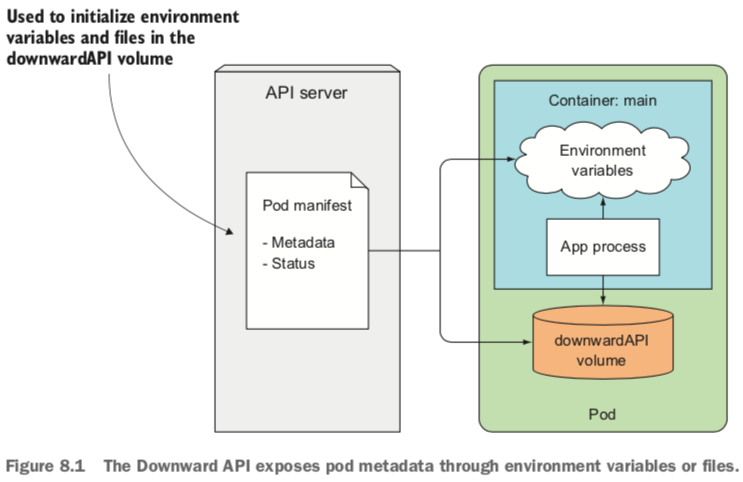

###	Passing metadata through the Downward API
*	 It allows you to pass metadata about the pod and its environment through environment variables or files (in a downwardAPI volume). 




#### Understanding the available metadata
*	The pod's name
* 	The pod's IP address
*	The namespace the pod belongs to
* 	The name of the node the pod is running on
*  	The name of the service account the pod is running under
*	The CPU and memory requests for each container(mininum)
* 	The CPU and memory limits for each container(maxinum)
*	The pod's labels
* 	The pod's annotations


```
kubectl exec {pod_name} env
kubectl exec {pod_name} ls -lL /etc/{pod_name}

kubectl exec {pod_name} cat /etc/{pod_name}/labels
kubectl exec {pod_name} cat /etc/{pod_name}/annotations
kubectl exec {pod_name} cat /etc/{pod_name}/containerMemoryLimitBytes

```

### Exploring the Kubernetes REST API
```
kubectl cluster-info
kubectl proxy
```

### Client
*	Golang client — https://github.com/kubernetes/client-go
*	Python client — https://github.com/kubernetes-incubator/client-python
