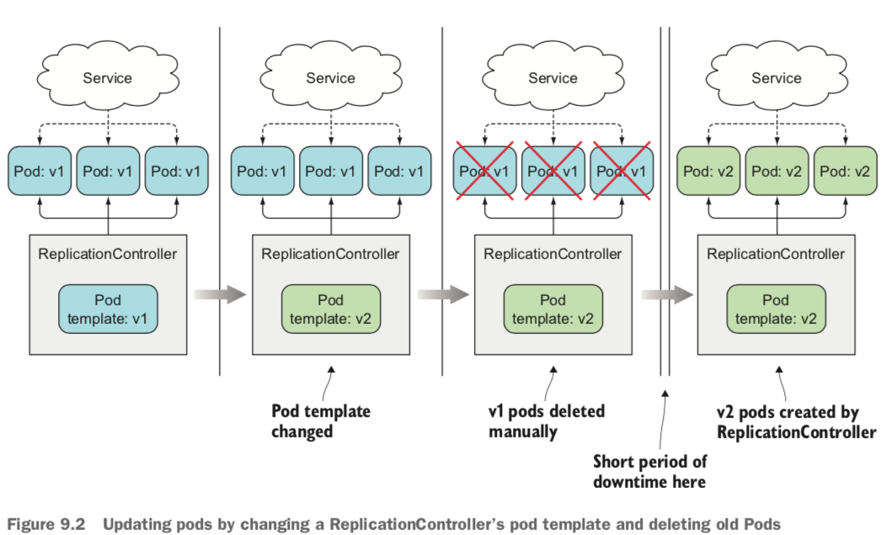
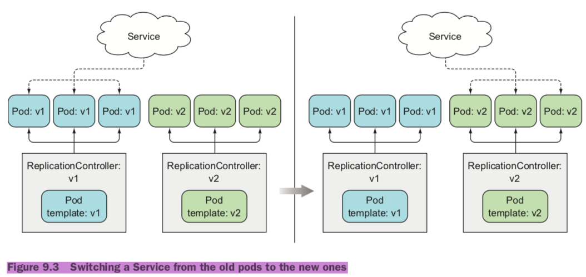
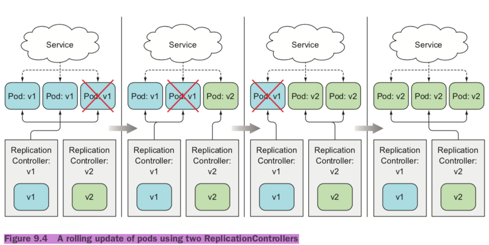

*	`ReplicaSets(RS)` manage Pods
* 	`Deployments` manage ReplicaSets

```
kubectl run <pod_name> --image=<image_name>:<tag_name>
kunectl get deployments <pod_name>
kunectl get replicasets --selector=run=nginx
kunectl scale deployments nginx --replicas=2
kunectl describe deployments nginx
```

### `kubectl run`
```
kubectl run <deployment_name>  \
--image=<image_name>:<tag_name> \
--env=MYSQL_ROOT_PASSWORD=root \
--port=3306 \
--command -- sh -c "sleep 2" \
--expose \
--replicas=2 \
```

### Scaling a deployment
```
spec:
	replicas: 3
```

### Updating a container Image
```
	containers:
	- image: nginx: 1.9.10
	  imagePullPolicy: Always
```

### Updating applications running in pods
#### imager verion v1 -> v2
*	Delete all existing pods first and then start the new ones.(	停机发布)
* 	Start new ones and delete the old ones.(灰度发布)


#### Deleting old pods and replacing them with new ones
*	The pod template of a ReplicationController can be updated at any time. When the ReplicationController creates new instances, it uses the updated pod template to create them.



#### Spinning up new pods and then deleting the old ones
*	multiple version at once
* 	This will require more hardware resources

#####	SWITCHING FROM THE OLD TO THE NEW VERSION AT ONCE



```
kubectl set selector 
```

##### PERFORMING A ROLLING UPDATE
*	replaces pods step by step




### Deployment Strategies
*	Recreate
* 	RollingUpdate


```
kubectl edit
kubectl patch
kubectl apply
kubectl replace
kubectl set image
```

