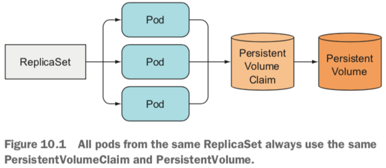
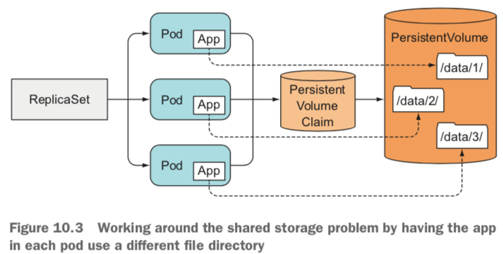
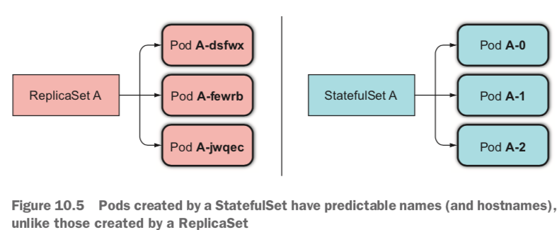

*	Deploying replicated stateful applications

### Properties
*	Each replica gets a persistent hostname with a unique index(e.g., database-0, database-1, etc)
* 	Each replica is created in order from lowest to highest index, and creation will block until the Pod at the previous index is healthy and available. This also applies to scaling up.
*  When deleted, each replica will be deleted in order from highest to lowest. This also applies to scaling down.

### Replicating stateful pods
*	ReplicaSets create multiple pod replicas from a single pod template.




### Running multiple replicas with separate storage for each
*	USING MULTIPLE DIRECTORIES IN THE SAME VOLUME



### Providing a stable identity for each pod
*	cluster member(集群信息)

## StatefulSet
*	Which is specifically tailored to applications where instances of the application must be treated as non-fungible individuals, with each one having a stable name and state.

### Providing a stable network identity


*	REPLACING LOST PETS
* 	SCALING A STATEFULSET(always removes the instances with the highest ordinal index first)

### Providing stable dedicated storage to each stateful instance
*	storage for stateful pods needs to be persistent and decoupled from the pods. 

### MongoDB
```
vim mongodb-simple.yaml
apiVersion: apps/v1beta1
kind: StatefulSet
metadata:
	name: mongodb
spec:
	serviceName: "mongon"
	replicas: 3
	template:
		metadata:
			labels:
				app: mongo
		spec:
			containers:
				- name: mongondb
				  image: mongo:3.4.1
				  command:
				  	- mongod
				  	- --replSet
				  	- rs0
				  ports:
				  	- containerPort: 27017
				  	  name: peer

kubectl apply -f mongodb-simple.yaml
kubectl get pods
```

```
vim mongodb-service
apiVersion: v1
kind: Service
metadata:	
	name: mongodb
spec:
	ports
		- port: 27017
		  name: peer
	clusterIP: None
	selector:
		app: mongo
```

```
mongo.default.svc.cluster.local
kubectl exec mongo-0 bash ping mogon-1.mongo
kubectl exec -it mongo-1 mongo
```

####	Automating MongoDB cluster Creation
