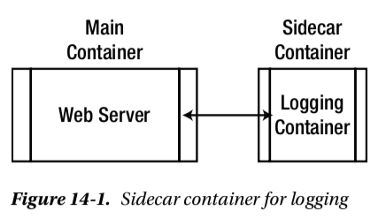
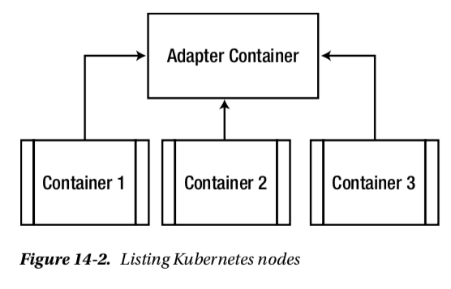

### Single-node, multiple-container application pattern
#### Sidecar
*	A main container and a sidecat container
*	Containers on the same node are able to share a local disk volume.

#### Adapter
*	provide a unified interface for aggregating(pods or containers)
 

