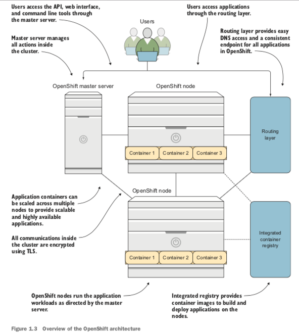
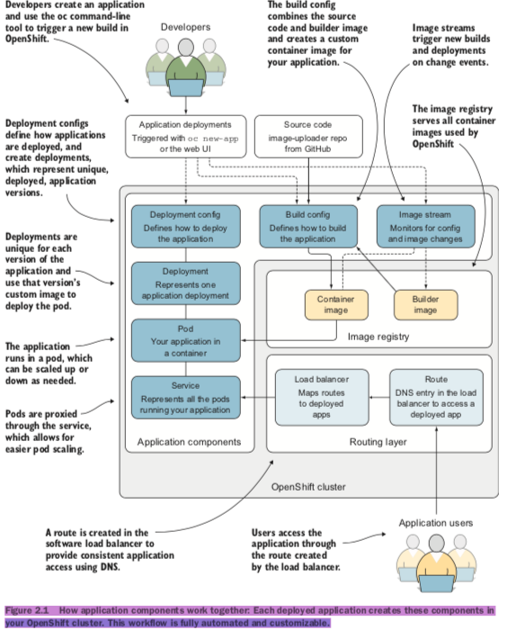

### Network
*	Docker: overlay
* 	Kubernets: service
*  OpenShift: rounting layer
	*	a software load balancer(DNS entrypoint)  
	* 	SDN(Open vSwitch)

### Architecture

### Workflows
*	Build
* 	Deployment
*	Upgrade
* 	Retirement

### References
*	http://www.openshift.com/container-platform/kubernetes.html
* 	[Minishift](https://github.com/minishift/minishift)
*	https://github.com/OpenShiftInAction
